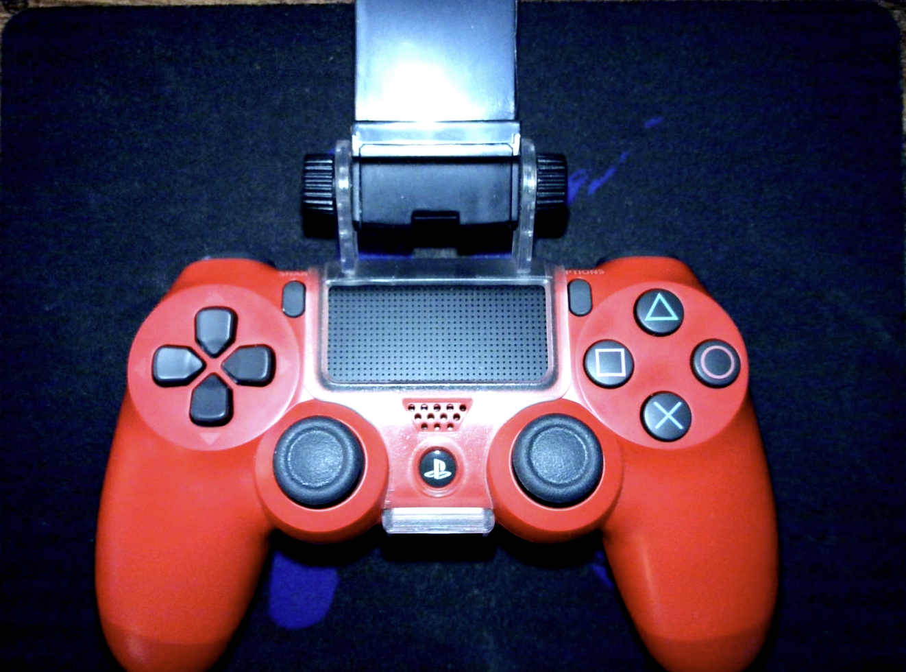
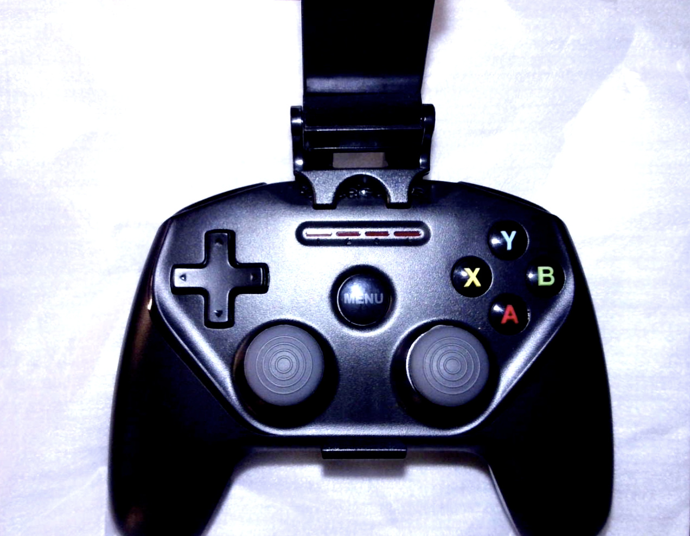
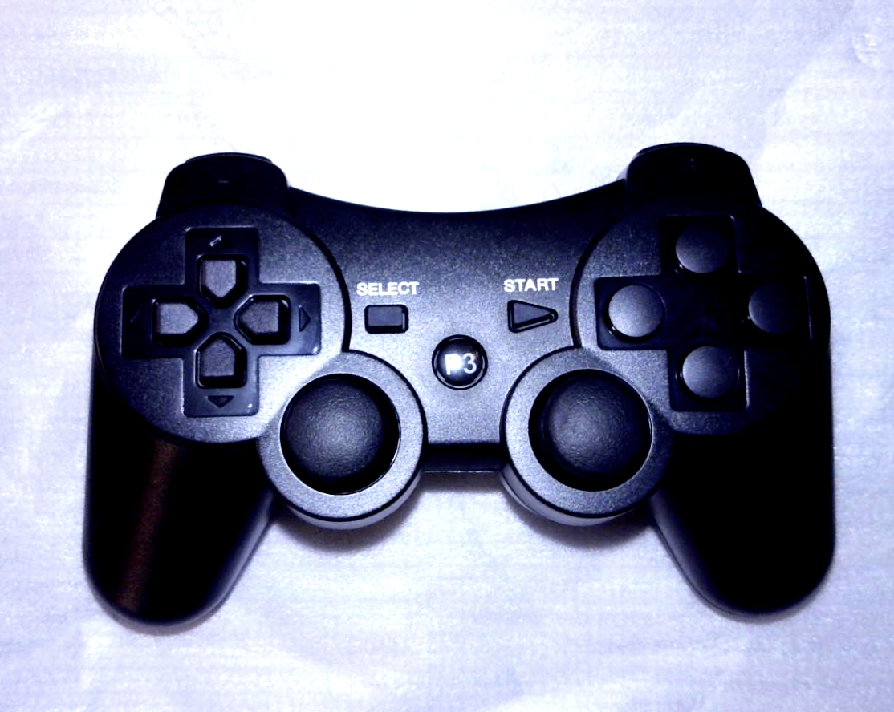
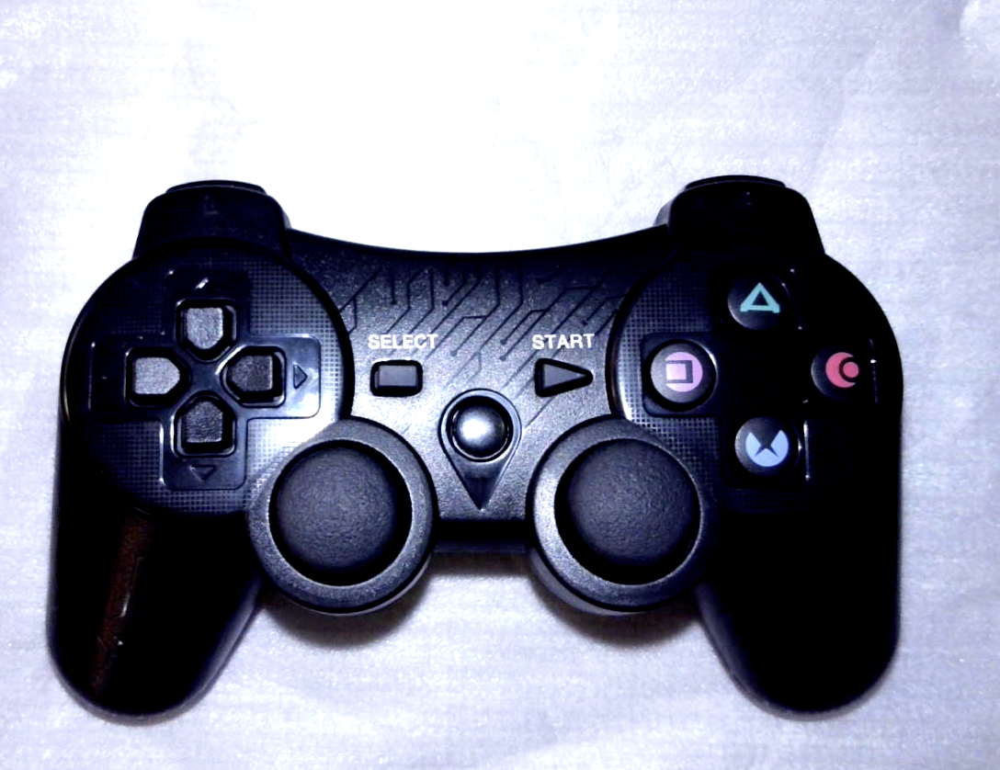

# GamePad Controllers
Documentation about GamePad controllers that work with the ESP32 controller

## PS 4

Genuine PS4 gamepads are among the most responsive when used to fly the Tello.

Steelcase Nimbus gamepads are also very responsive when used to fly the Tello.

The clone pictured above (no button markings) was advertised online as PS3 clone. But when connected using the bluepad32 demo, it self-identifies as an XBox controller when paired with the Y plus PS3 button combination.

The PS3 clone pictured above does identify itself as DualShock PS3. As such, it must be manually paired to match the Bluetooth MAC address of the ESP32 that you want to connect it to. How to do this is documented in the Bluepad32 project pages.

This T3s GameSir identifies itself as a Switch Pro controller when paired using the Y plus Home button combination.